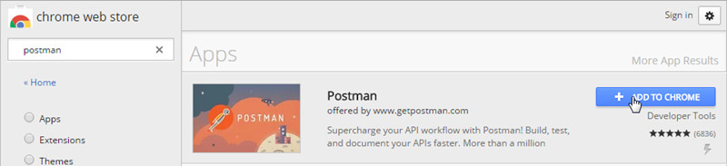

# Oracle Identity Cloud Service (IDCS) REST Client Samples

This code contains a collection of sample REST API requests that can be used in clients such as [Postman](http://getpostman.com) to make test calls to Oracle Identity Cloud Service (IDCS). 

This application is provided “AS IS” with no express or implied warranty for accuracy or accessibility. The sample code is intended for study purposes and does not represent, by any means, the recommended approach or is intended to be used in development or productions environments.

## Requirements
Chrome Web Browser with [Postman Extension](https://chrome.google.com/webstore/detail/postman-rest-client-packa/fhbjgbiflinjbdggehcddcbncdddomop) installed.

Register and activate a Client Application in Identity Cloud Service with the following characteristics, and then copy the application `client id` and `client secret`:

---
- **Application Type:** Trusted
- **Name:** REST Test
- **Description:** This client will be used to test REST API calls.
- **Authorization:** *Configure this application as client now* selected
- **Allowed Grant Types:** select *Resource Owner* and *Client Credentials*
- **Grant the client access to Identity Cloud Service Admin APIs:** selected. Also, select *Identity Domain Administrator*
---

## Setup
1. Open Google Chrome, visit `chrome://apps`, and then launch **Postman**.
2. Click **Import** 
3. In **Import from Link**, paste the Identity Cloud Service [environment template](idcs_postman_environment.json)
4. Repeat the import, and paste the Identity Cloud Service [global variables](idcs_postman_globals.json)
5. Click **Settings** (gear icon) and select **Manage environments**
6. Click the **Duplicate environment** next to **EXAMPLE_IDCS**
7. Click **EXAMPLE_IDCS copy**
8. Update the environment variables and click **Update**:

 - `HOST`: the Identity Cloud Service UI address. For example: *https://**example**.identity.oraclecorp.com*
 - `CLIENT_ID` and `CLIENT_SECRET`: the client id and secret obtained from your Identity Cloud Service application.
 - `USER_LOGIN` and `USER_PW`: the user login and password (in case you want to use the *password_grant* or *authorization_code* g)

9. Click the **Environment combo box** (top-right corner) and select `your environment`.

## Get collections
After setting up Postman and obtaining an access_token, you can leverage our sample collections. To do this:
1. In Postman, click **import**.
2. Select the **From URL** tab and import the following URLs:

- [User](idcs_user_postman_collection.json)
- [Group](idcs_group_postman_collection.json)
- [Applications](idcs_app_postman_collection.json)
- [Bulk](idcs_bulk_postman_collection.json)
- [Report](idcs_report_postman_collection.json)
- [Self](idcs_self_postman_collection.json)
- [OAuth](idcs_oauth_postman_collection.json)

## Make requests
Each Identity Cloud Service collection contains REST API calls with request **uris**, **headers**, and **body** parameters.
To perform your calls, you will need to modify these parameters according to your preferences.

For a general example on how to take advantage of the sample requests, check the [Testing IDCS REST APIs with Postman](http://apexapps.oracle.com/pls/apex/f?p=44785:112:0::::P112_CONTENT_ID:13484) tutorial.
For high-level instructions on how to use each collection, check its respective readme file:

- [User](idcs_user_postman_collection.md)
- [Group](idcs_group_postman_collection.md)
- [Applications](idcs_app_postman_collection.md)
- [Bulk](idcs_bulk_postman_collection.md)
- [Report](idcs_report_postman_collection.md)
- [Self](idcs_self_postman_collection.md)
- [OAuth](idcs_oauth_postman_collection.md)

## License

Copyright (c) 2016, Oracle and/or its affiliates. All rights reserved.

You may not use the identified files except in compliance with the
Universal Permissive License (UPL), Version 1.0 (the "License.")

You may obtain a copy of the License at
https://opensource.org/licenses/UPL. 

Unless required by applicable law or agreed to in writing, software
distributed under the License is distributed on an "AS IS" BASIS, WITHOUT
WARRANTIES OR CONDITIONS OF ANY KIND, either express or implied.

See the License for the specific language governing permissions and
limitations under the License.
