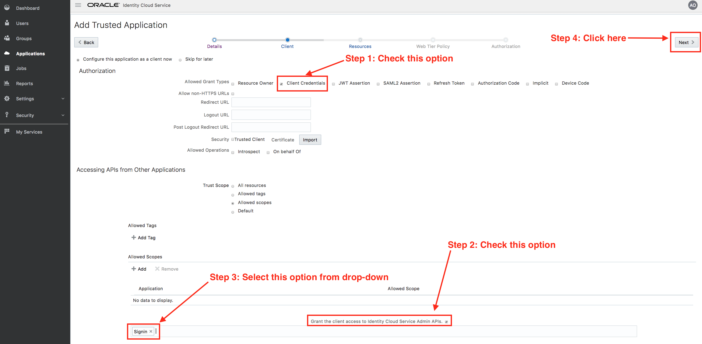
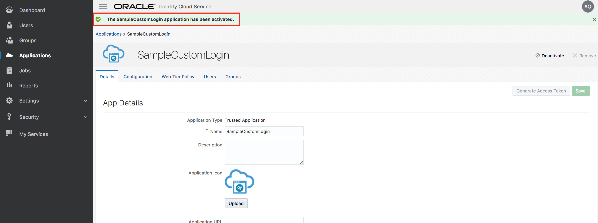
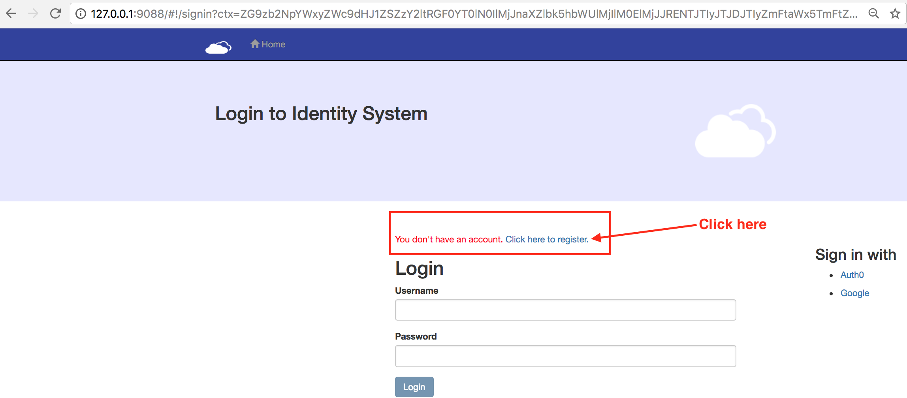

# IDCS Custom Login

This is a sample application that hosts Custom Login interface for IDCS. This application leverages **Angular JS** front-end and **Node JS** middleware. 

**Phase 1:**

- User name and password
- Social login
- Social registration

**Phase 2:**

- MFA
- Password expiry/reset


### Setup:  

#### Create a client App in IDCS:

- Go the **IDCS admin console** and login using admin credentials

- Go to the Applications tab and create  a trusted app. *Follow the directions on screenshots below*.







- Note the **Client ID** and **Client Secret** of the app. These will be used while configuring custom login app.


 
#### Run the custom app:

<blockquote>
The instructions below assume that you are running the custom login app in a local linux/Mac laptop/desktop with Node JS installed. If you are running in a Windows box, necessary steps need to be taken to run a Node JS app.
</blockquote>

- From command line, download the source from github - 

	`git clone https://github.com/sttoracle/Security-Assets.git`
	
- Go the following folder from **\<INSTALL-DIRECTORY\>**

	`cd Security-Assets/idcs/samples/SampleCustomLogin`
	
- Edit the **secrets.js** file present under **config** folder

    `vi config/secrets.js` 
    
- Provide the **Client ID** and **Client Secret** values copied before.

- Provide appropriate IDCS host and port values


		
- Save **secrets.js**

- Download JS libraries.

	```js
	cd <INSTALL-DIRECTORY>/Security-Assets/idcs/samples/SampleCustomLogin
	cd public
	bower install
	cd ..
	npm install
	
- Start the App from command line.

	```js
	cd <INSTALL-DIRECTORY>/Security-Assets/idcs/samples/SampleCustomLogin
	nohup node server.js &
	
#### Configure IDCS to use the custom login page 

- From **IDCS admin console**, access the **Session Settings** page


- Provide the custom app URL's for **Login URL** and **Error URL** attributes


### Verify: 

#### User name + Password login:

- Go to IDCS login URL. It has the form - [https://idcs-xxxxxxxxxxxxx.identity.oraclecloud.com/ui/v1/myconsole]()

- Verify that you are redirected to the custom app login page. If you are running locally the URL will look like - [http://127.0.0.1:9088/#!/signin]()


- Provide a valid user name and password. Click on **Login**


- Verify that on successful login, you are redirected to the IDCS MyApps page.


#### Logout:

- Logout from IDCS


- Verify that you are redirected back to the custom login page


#### Social registration:

<blockquote>
Pre-requisite for this use case is, IDCS is configured to use social login through Google. 
</blockquote>

- Verify that the custom login page shows the option for signing in with **Google**. Click on the link. 


- Choose your google account and login using your google credentials.


- Verify that the custom page reports that user does not exist in IDCS and provides option for registration. Click on the registration link.



- Click **Register** to complete the registration.


- Verify that you are redirected to the IDCS MyApps page.


- Sign out from IDCS


- Sign out from google using a separate browser tab.


#### Social login:

<blockquote>
Pre-requisites for this use case are -	1. IDCS is configured to use social login through Google. 2. The google account is already registered in IDCS.
</blockquote>

- Initiate login using **Google** provider on the custom login page


- Choose your google account and login using your google credentials. If you are already logged in to your google account, this step will be bypassed.


- Verify that you are redirected to the IDCS MyApps page.


